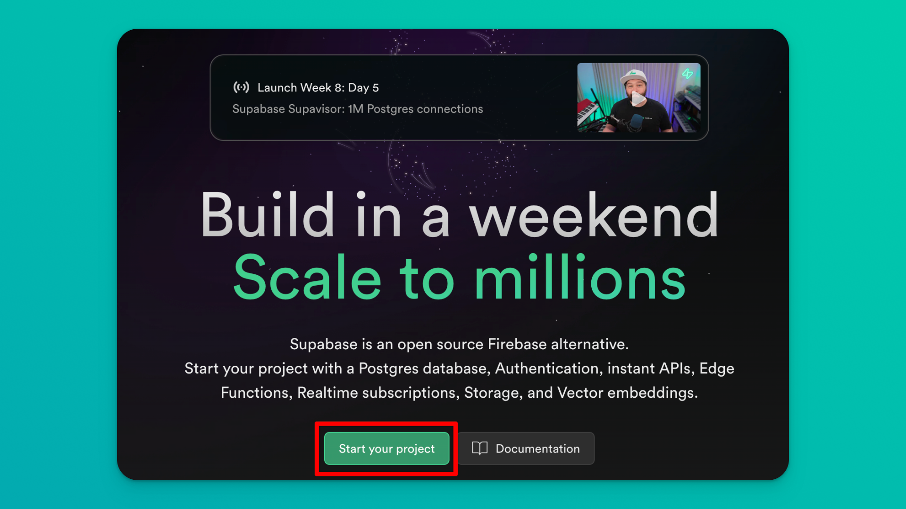
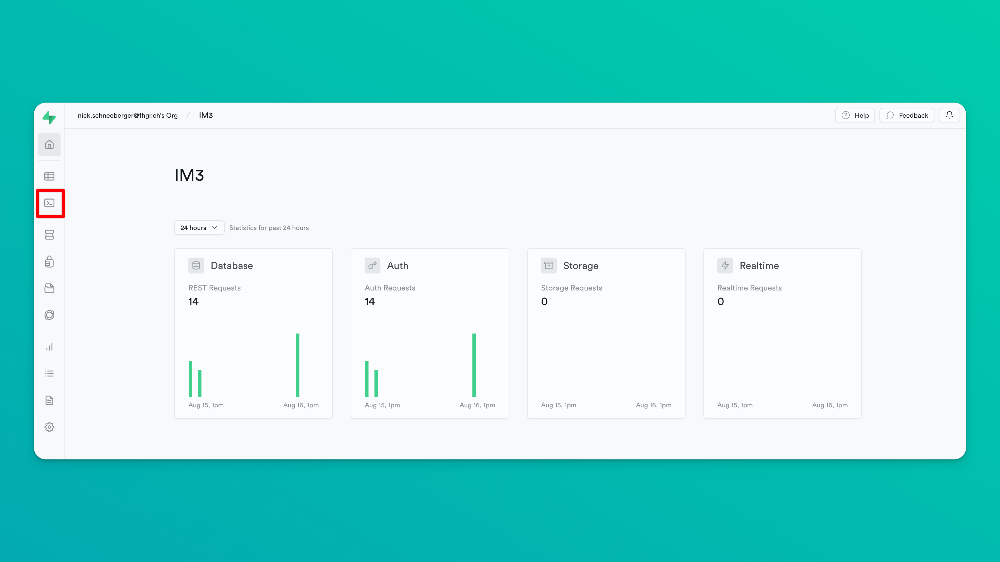
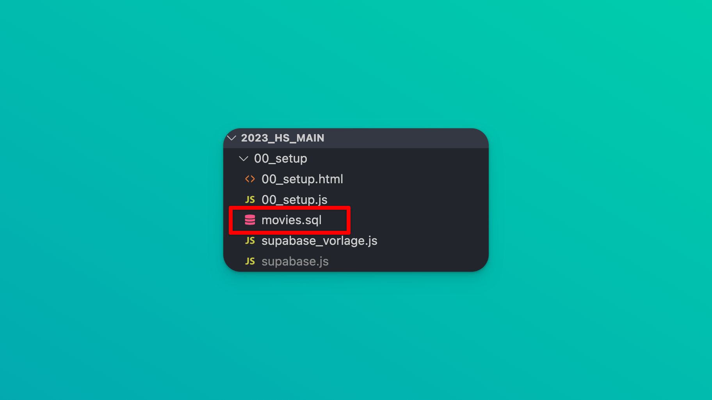
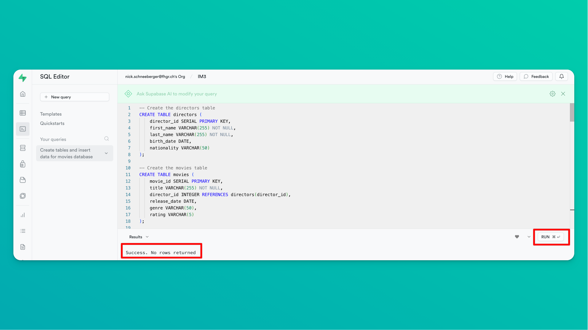
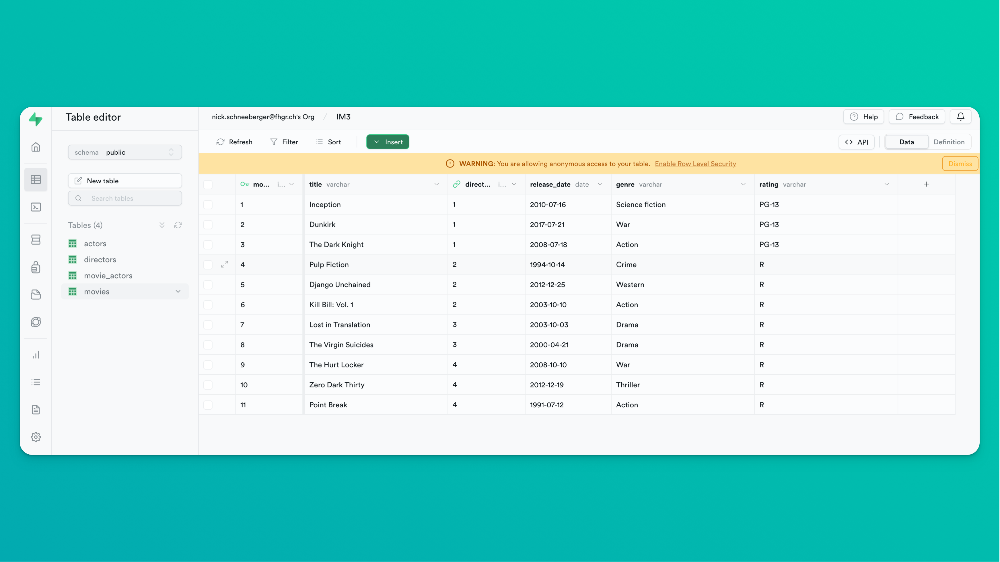
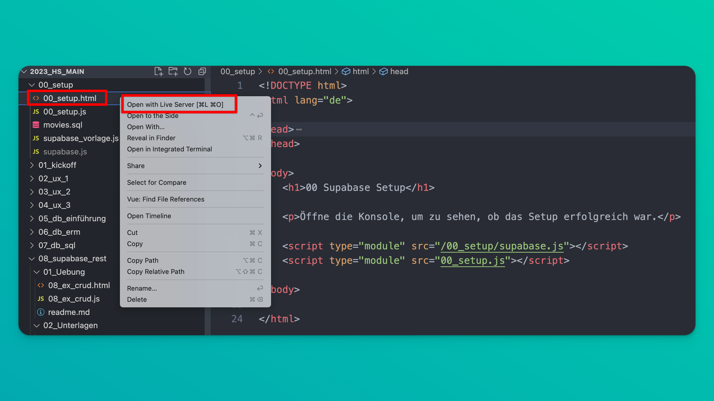
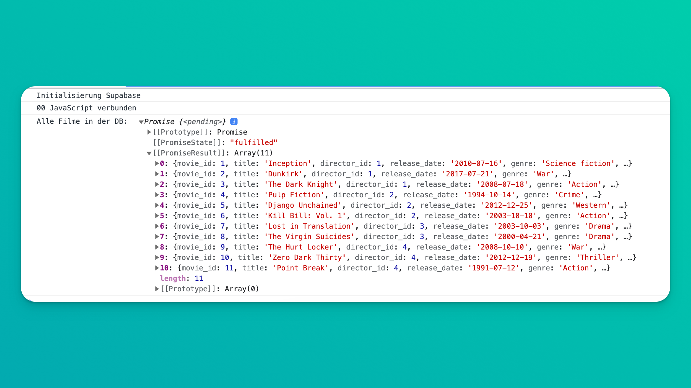

# Supabase Tutorial

Dieses Tutorial besteht aus 3 Kapiteln und 

## Einen Account erstellen

1. Gehe auf [supabase.io](https://supabase.io/) und klicke auf den Button "Start your project".

2. Klicke unten auf den Button "Sign Up Now"

3. Erstelle deinen Account entweder mit GitHub (empfohlen) oder gib deine E-Mail-Adresse und dein Passwort ein.

4. Wenn du dich mit E-Mail und Passwort angemeldet hast, klicke auf den Link in der Bestätigungsmail. Bei der Anmeldung mit GitHub fällt dieser Schritt möglicherweise weg.

5. Wenn die Registrierung resp. das Login erfolgreich war, solltest du das leere Dashboard sehen. Nun kannst du ein neues Projekt erstellen.

## Ein neues Projekt erstellen

1. Klicke im Dashboard auf den grünen Button "New Project" und wähle deine Organisation aus.

2.  1. Gib dem Projekt einen Namen. Bspw. IM3
    2. Setze ein starkes Passwort. Es wird empfohlen, dieses automatisch zu generieren. Für unseren Anwendungsfall musst du das Passwort nirgendwo speichern.
    3. Wähle die Region aus, in der die Daten gespeichert werden sollen. Hier macht es Sinn die Region auszuwählen, die am nächsten bei dir ist.
    4. Wähle den Gratis-Plan aus.
    5. Klicke auf den Button "Create Project"

3. Wenn das Projekt erfolgreich erstellt wurde, siehst du das Dashboard mit deinem Projekt.

## Mit Supabase verbinden & Verbindung testen

Nun wollen wir unser Projekt mit Supabase verbinden. Dazu müssen wir die Verbindungsdaten kopieren und in unserem Projekt einfügen, einen Datensatz importieren und die Verbindung testen.

### Verbindungsdaten kopieren

1. Klicke auf das kleine Zahnrad in der linken unteren Ecke in der Navigation.

2. Klicke dann auf den Abschnitt API in der Navigation links.

3. Kopiere folgende Informationen:
    1. Die Project URL (in unserem JS-File heisst die Variable dann supabaseUrl)
    2. Den anonymen Public Key (in unserem JS-File heisst die Variable dann supabaseKey)

4. Ersetze in `supabase_vorlage.js` die beiden Variablen `supabaseUrl` und `supabaseKey` mit den kopierten Werten. 

5. Benenne die Datei `supabase_vorlage.js` zu `supabase.js` um. Ansonsten wird diese nicht erkannt.

Um die Datenbank-Verbindung zu testen, importieren wir einen ersten Datensatz in unser Projekt.

### Datensatz importieren

1. Vom Supabase Dashboard, klicke links in der Navigation auf den 'SQL-Editor'.

2. Wenn du den Editor geöffnet hast, gehe in deinen Projektordner und öffne im Ordner `00_setup` das Dokument `movies.sql`. 

3. Kopiere den Inhalt aus `movies.sql` und füge ihn in den SQL-Editor ein. Klicke dann auf den Button "Run". Die Nachricht "Success. No rows returned." sollte erscheinen.

4. Trotz der erfreulichen Nachricht kontrollieren wir, ob unsere Tabellen tatsächlich importiert wurden. Klicke dazu links in der Navigation auf den Abschnitt "Tables" und dann auf die Tabelle "movies".

Sieht gut aus, die Tabelle ist befüllt!

### Datenbankverbindung testen

1. Um die Datenbankverbindung zu testen, öffne VS Code. Klicke links auf die Datei ` 00_setup.html` und starte mit Rechtsklick den Live-Server.

**Tipp:** Falls die Option Live-Server nicht erscheint, musst du zuerst die Live-Server Extension installieren. Klicke dazu auf das Extensions-Symbol in der linken Navigation und suche nach "Live Server". Installiere die Extension und starte VS Code neu.

2. Öffne nun die Browser-Konsole. Wenn alles geklappt hat, werden in der Zeile `Alle Filme in der DB:` bei Klick auf  `Promise {<pending>}` und anschliessendem Klick auf `Array(11)` alle Spalten der Tabelle `movies` angezeigt.

Du hast dein Projekt erfolgreich mit Supabase verbunden! Gratuliere!