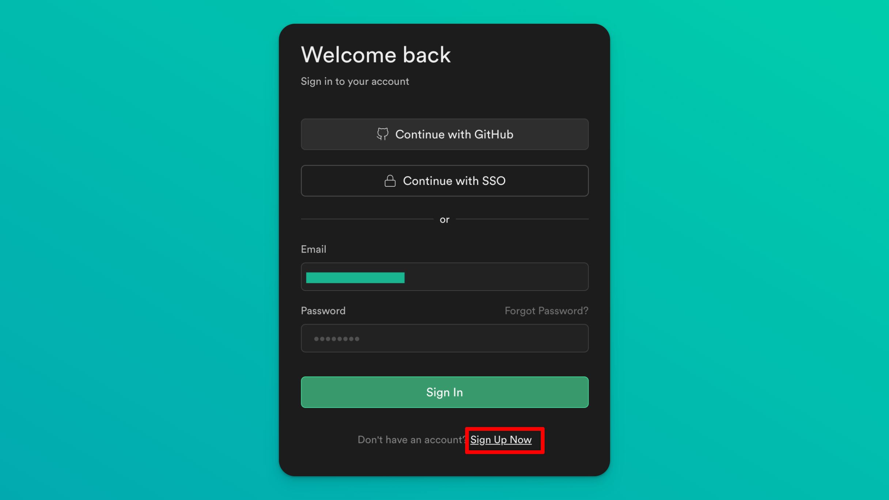
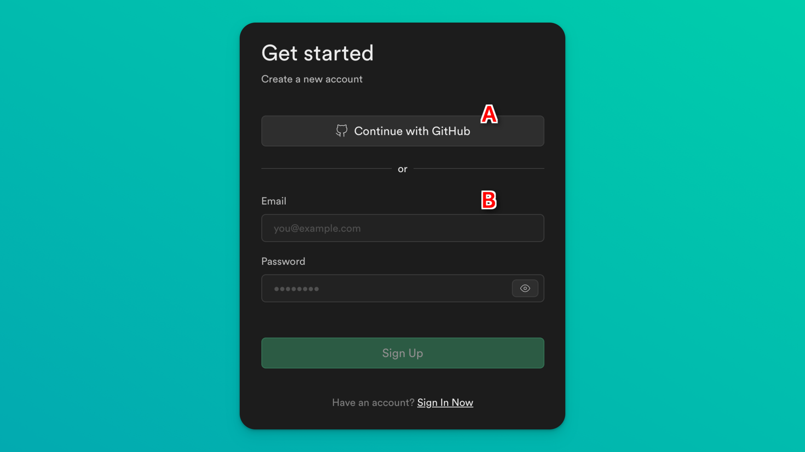
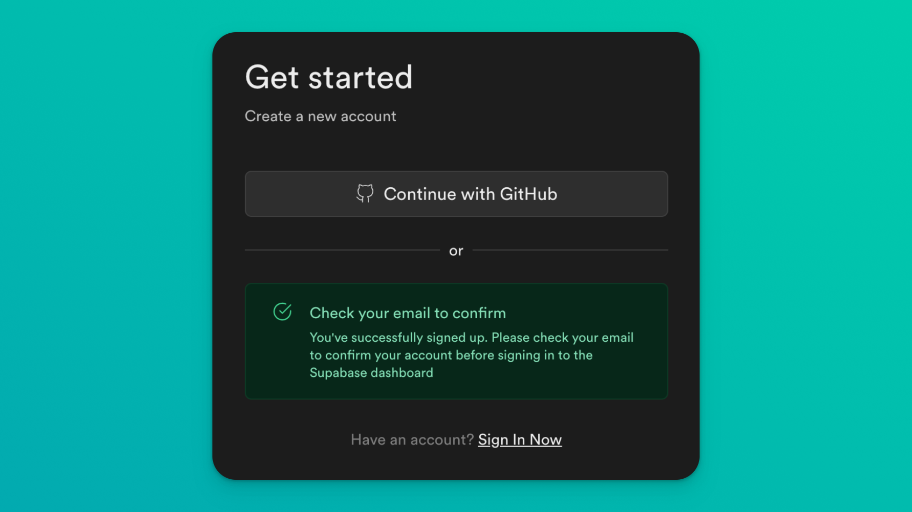
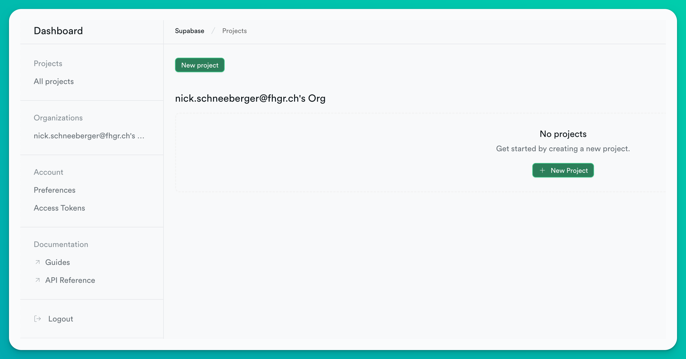
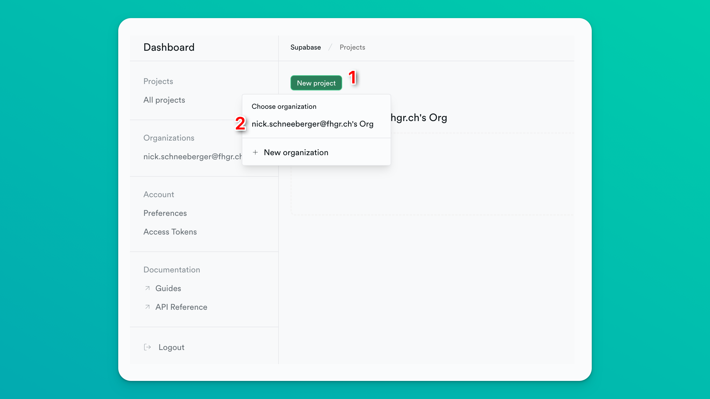
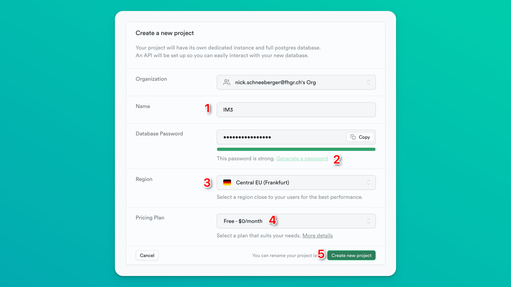
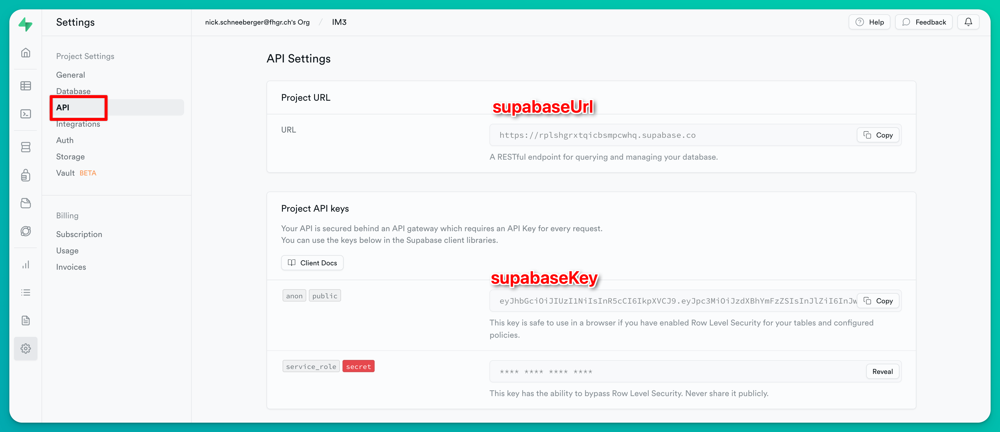

# Supabase Tutorial

Dieses Tutorial besteht aus 3 Kapiteln und 

## Einen Account erstellen

1. Gehe auf [supabase.io](https://supabase.io/) und klicke auf den Button "Start your project".

2. Klicke unten auf den Button "Sign Up Now"

3. Erstelle deinen Account entweder mit GitHub (empfohlen) oder gib deine E-Mail-Adresse und dein Passwort ein.

4. Wenn du dich mit E-Mail und Passwort angemeldet hast, klicke auf den Link in der Bestätigungsmail. Bei der Anmeldung mit GitHub fällt dieser Schritt möglicherweise weg.

5. Wenn die Registrierung resp. das Login erfolgreich war, solltest du das leere Dashboard sehen. Nun kannst du ein neues Projekt erstellen.

## Ein neues Projekt erstellen

1. Klicke im Dashboard auf den grünen Button "New Project" und wähle deine Organisation aus.

2.  1. Gib dem Projekt einen Namen. Bspw. IM3
    2. Setze ein starkes Passwort. Es wird empfohlen, dieses automatisch zu generieren. Für unseren Anwendungsfall musst du das Passwort nirgendwo speichern.
    2. Wähle die Region aus, in der die Daten gespeichert werden sollen. Hier macht es Sinn die Region auszuwählen, die am nächsten bei dir ist.
    3. Klicke auf den Button "Create Project"

3. Wenn das Projekt erfolgreich erstellt wurde, siehst du das Dashboard mit deinem Projekt.

## Verbindungsdaten für die Supabase kopieren

1. Klicke auf das kleine Zahnrad in der linken unteren Ecke in der Navigation.

2. Klicke dann auf den Abschnitt API in der Navigation links.

3. Kopiere folgende Informationen:
    1. Die Project URL (in unserem JS-File heisst die Variable dann supabaseUrl)
    2. Den anonymen Public Key (in unserem JS-File heisst die Variable dann supabaseKey)

4. In `supabase_vorlage.js` kannst du die beiden Variablen `supabaseUrl` und `supabaseKey` mit den kopierten Werten ersetzen. 

**Wichtig:** Damit das File in diesem Übungsordner richtig funktioniert, bennene es zu `supabase.js` um.

